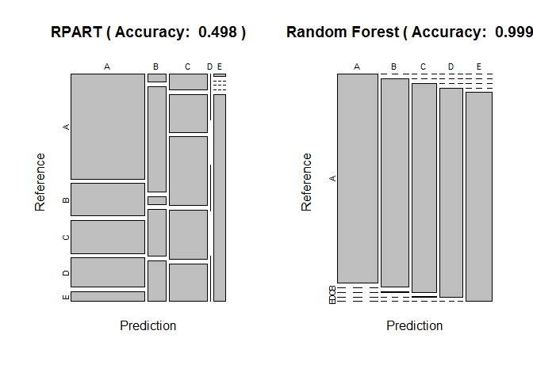
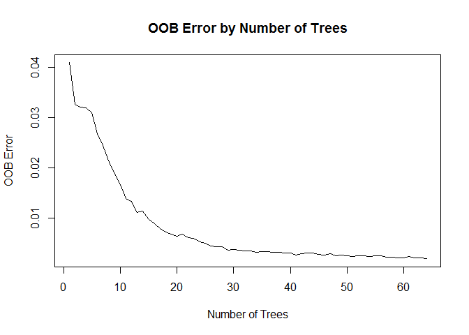

## Snyopsis  
  
Analyzing data (source: http://groupware.les.inf.puc-rio.br/har) from sensors worn on the body and placed within exercise equipment, we classify how *well* a certain exercise activity was performed by six human volunteers. The classifications are: "A" - exactly according to the specification, "B" - throwing the elbows to the front, "C" - lifting the dumbbell only halfway, "D" - lowering the dumbbell only halfway, and "E" - throwing the hips to the front. Class "A" is the only correct procedure, rest all four are faulty.  
  
For our purpose, we compare two methods--Recursive Partitioning And Regression Trees (rpart) and Random Forest (rf)--for their prediction accuracy and choose the more accurate to apply to the validation data set.  
  
## Gathering and Cleaning Data  

Downloading data files and reading them in:  

```r
fileURL1 = "https://d396qusza40orc.cloudfront.net/predmachlearn/pml-training.csv"
download.file(fileURL1, "builddata.csv")

fileURL2 = "https://d396qusza40orc.cloudfront.net/predmachlearn/pml-testing.csv"
download.file(fileURL2, "validatedata.csv")

buildset = read.csv("builddata.csv")
validateset = read.csv("validatedata.csv")
```

Explore data structure:  

```r
str(buildset, list.len = 20)
```

```
## 'data.frame':	19622 obs. of  160 variables:
##  $ X                       : int  1 2 3 4 5 6 7 8 9 10 ...
##  $ user_name               : Factor w/ 6 levels "adelmo","carlitos",..: 2 2 2 2 2 2 2 2 2 2 ...
##  $ raw_timestamp_part_1    : int  1323084231 1323084231 1323084231 1323084232 1323084232 1323084232 1323084232 1323084232 1323084232 1323084232 ...
##  $ raw_timestamp_part_2    : int  788290 808298 820366 120339 196328 304277 368296 440390 484323 484434 ...
##  $ cvtd_timestamp          : Factor w/ 20 levels "02/12/2011 13:32",..: 9 9 9 9 9 9 9 9 9 9 ...
##  $ new_window              : Factor w/ 2 levels "no","yes": 1 1 1 1 1 1 1 1 1 1 ...
##  $ num_window              : int  11 11 11 12 12 12 12 12 12 12 ...
##  $ roll_belt               : num  1.41 1.41 1.42 1.48 1.48 1.45 1.42 1.42 1.43 1.45 ...
##  $ pitch_belt              : num  8.07 8.07 8.07 8.05 8.07 8.06 8.09 8.13 8.16 8.17 ...
##  $ yaw_belt                : num  -94.4 -94.4 -94.4 -94.4 -94.4 -94.4 -94.4 -94.4 -94.4 -94.4 ...
##  $ total_accel_belt        : int  3 3 3 3 3 3 3 3 3 3 ...
##  $ kurtosis_roll_belt      : Factor w/ 397 levels "","-0.016850",..: 1 1 1 1 1 1 1 1 1 1 ...
##  $ kurtosis_picth_belt     : Factor w/ 317 levels "","-0.021887",..: 1 1 1 1 1 1 1 1 1 1 ...
##  $ kurtosis_yaw_belt       : Factor w/ 2 levels "","#DIV/0!": 1 1 1 1 1 1 1 1 1 1 ...
##  $ skewness_roll_belt      : Factor w/ 395 levels "","-0.003095",..: 1 1 1 1 1 1 1 1 1 1 ...
##  $ skewness_roll_belt.1    : Factor w/ 338 levels "","-0.005928",..: 1 1 1 1 1 1 1 1 1 1 ...
##  $ skewness_yaw_belt       : Factor w/ 2 levels "","#DIV/0!": 1 1 1 1 1 1 1 1 1 1 ...
##  $ max_roll_belt           : num  NA NA NA NA NA NA NA NA NA NA ...
##  $ max_picth_belt          : int  NA NA NA NA NA NA NA NA NA NA ...
##  $ max_yaw_belt            : Factor w/ 68 levels "","-0.1","-0.2",..: 1 1 1 1 1 1 1 1 1 1 ...
##   [list output truncated]
```

Of 160 columns, many are with near zero variance, of little relevance to our classification purpose, or with too many missing values. Identifying such columns and removing from the datasets. 

```r
library(caret)
```

```
## Loading required package: lattice
```

```
## Loading required package: ggplot2
```

```r
# near zero variance
NZV = nearZeroVar(buildset)

# irrelevant columns with serial number of observations, names of volunteers, and three types of timestamps 
irrelev = 1:5

# columns with more than 90% missing values

missvalcol = numeric()
for(i in 1:ncol(buildset)){
ifelse((length(which(is.na(buildset[,i]))) / length(buildset[,i])) > 0.90, missvalcol[i] <- i, missvalcol[i] <- 
0)
}

# removing columns identified to be dropped 

buildset = buildset[,-c(NZV, irrelev, missvalcol)]
validateset = validateset[,-c(NZV, irrelev, missvalcol)]
```

## Setting Data for Cross Validation  
  
For cross-validation, We choose random sampling without replacement to partition the build data set into a training set (70%) and a test set (30%). 


```r
set.seed(321321)

rowtrain = createDataPartition(buildset$classe, p = 0.70, list = FALSE)

trainset = buildset[rowtrain, ]
testset = buildset[-rowtrain, ]
```

## Build and Compare Models  

### Build  

It being a classification problem, we will compare the performance of Recursive Partitioning and Regression Trees (rpart) and Random Forest (rf).  

```r
set.seed(321321)
fit.rpart = train(data= trainset, classe~., method = "rpart")
fit.rf = train(data= trainset, classe~., method = "rf", ntree = 64)
```

**NOTE:** we have limited the number of trees in Random Forest to 64 because of computational resource constraint. Our decision to choose the number 64 is backed by research from Oshiro et al. (2012).  
  
### Compare  

We will compare the accuracy of both models on goodness of fit against training data, as well as prediction against test data.  

```r
pred.rpart = predict(fit.rpart, newdata = testset)
pred.rf = predict(fit.rf, newdata = testset)

confmat.rpart = confusionMatrix(pred.rpart, testset$classe)
confmat.rf = confusionMatrix(pred.rf, testset$classe)

fit.rpart$results[fit.rpart$results[,"cp"]==fit.rpart$bestTune$cp,c("Accuracy", "Kappa")]
```

```
##    Accuracy     Kappa
## 1 0.5448143 0.4171385
```

```r
fit.rf$results[fit.rf$results[,"mtry"]==fit.rf$bestTune$mtry,c("Accuracy", "Kappa")]
```

```
##    Accuracy     Kappa
## 2 0.9950994 0.9938015
```

```r
confmat.rpart$overall[c("Accuracy", "Kappa")]
```

```
##  Accuracy     Kappa 
## 0.4978760 0.3440489
```

```r
confmat.rf$overall[c("Accuracy", "Kappa")]
```

```
##  Accuracy     Kappa 
## 0.9991504 0.9989253
```

```r
par(mfrow= c(1,2), bg = "white")
plot(confmat.rpart$table, main = paste("RPART ( Accuracy: ", round(confmat.rpart$overall["Accuracy"],3),")"))
plot(confmat.rf$table, main = paste("Random Forest ( Accuracy: ", round(confmat.rf$overall["Accuracy"],3),")"))
```

<!-- -->

We see that Random Forest far outperforms RPART decision tree in accuracy on training and test sets and will therefore be our chosen model.  


```r
fit.rf$finalModel
```

```
## 
## Call:
##  randomForest(x = x, y = y, ntree = 64, mtry = param$mtry) 
##                Type of random forest: classification
##                      Number of trees: 64
## No. of variables tried at each split: 27
## 
##         OOB estimate of  error rate: 0.2%
## Confusion matrix:
##      A    B    C    D    E  class.error
## A 3904    1    0    0    1 0.0005120328
## B    6 2650    2    0    0 0.0030097818
## C    0    2 2394    0    0 0.0008347245
## D    0    0    7 2244    1 0.0035523979
## E    0    0    0    7 2518 0.0027722772
```

```r
plot(x=1:fit.rf$finalModel$ntree, y=fit.rf$finalModel$err.rate[,1], type="l", xlab="Number of Trees", ylab="OOB Error", main="OOB Error by Number of Trees")
```

<!-- -->

**We expect out-of-sample error against the validation set to be similar to the out-of-bag (OOB) error rate of the final model: ~0.2%.**  
  
The near flattening out of OOB error beyond (approx.) the 40th tree shows we have not overly compromised accuracy by limiting the number of trees to 64 in view of computational constraints.  

## Conclusion  

We predict against the validation set and present the prediction in the form required for the quiz:  

```r
finaloutput = data.frame(CaseID = 1:20, prediction = predict(fit.rf, validateset))
print(finaloutput)
```

```
##    CaseID prediction
## 1       1          B
## 2       2          A
## 3       3          B
## 4       4          A
## 5       5          A
## 6       6          E
## 7       7          D
## 8       8          B
## 9       9          A
## 10     10          A
## 11     11          B
## 12     12          C
## 13     13          B
## 14     14          A
## 15     15          E
## 16     16          E
## 17     17          A
## 18     18          B
## 19     19          B
## 20     20          B
```
